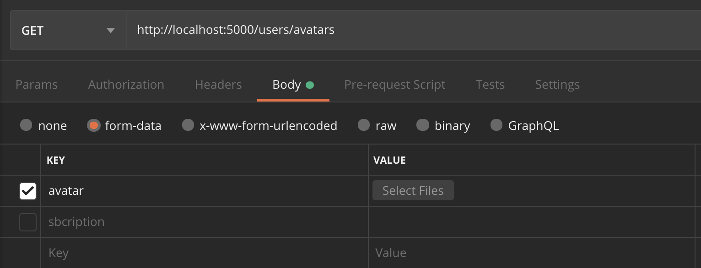

**Читать на других языках: [Русский](readme.md), [Українська](README.ua.md).**

## GoIT Node.js Course Template Homework

Выполните форк этого репозитория для выполнения домашних заданий (2-6) Форк
создаст репозиторий на вашем http://github.com

Добавьте ментора в коллаборацию

Для каждой домашней работы создавайте свою ветку.

- [hw02](https://github.com/vovababych/nodejs-homework-rest-api/tree/02-express)
- [hw03](https://github.com/vovababych/nodejs-homework-rest-api/tree/03-mongodb)
- [hw04](https://github.com/vovababych/nodejs-homework-rest-api/tree/04-auth)
- [hw05](https://github.com/vovababych/nodejs-homework-rest-api/tree/05-images)
- [hw06](https://github.com/vovababych/nodejs-homework-rest-api/tree/06-email)

Каждая новая ветка для дз должна делаться с master

После того как вы закончили выполнять домашнее задание в своей ветке, необходимо
сделать пулл-реквест (PR). Потом добавить ментора для ревью кода. Только после
того как ментор заапрувит PR, вы можете выполнить мердж ветки с домашним
заданием в мастер.

Внимательно читайте комментарии ментора. Исправьте замечания и сделайте коммит в
ветке с домашним заданием. Изменения подтянуться в PR автоматически после того
как вы отправите коммит с исправлениями на github После исправления снова
добавьте ментора на ревью кода.

- При сдаче домашней работы есть ссылка на PR
- JS-код чистый и понятный, для форматирования используется Prettier

### Команды:

- `npm start` &mdash; старт сервера в режиме production
- `npm run start:dev` &mdash; старт сервера в режиме разработки (development)
- `npm run lint` &mdash; запустить выполнение проверки кода с eslint, необходимо
  выполнять перед каждым PR и исправлять все ошибки линтера
- `npm lint:fix` &mdash; та же проверка линтера, но с автоматическими
  исправлениями простых ошибок

# Домашнее задание 6

Создай ветку `06-email` из ветки `master`.

Продолжи создание REST API для работы с коллекцией контактов. Добавь верификацию
email'а пользователя после регистрации при помощи
[SendGrid](https://sendgrid.com/).

## Как должно работать в конечном счете

Как пользователь, я должен:

1. При регистрации, получить письмо на указанную при регистрации почту с ссылкой
   для верификации email'а
2. Пройдя по ней в первый раз, я должен получить
   [Ответ со статусом 200](#verification-success-response), что будет
   подразумевать успешную верификацию email'a
3. Пройдя по ней второй, третий раз, я должен получить
   [Ошибку со статусом 404](#verification-user-not-found)

## Шаг 1

### Подготовка интеграции с SendGrid API

- Зарегистрируйся на [SendGrid](https://sendgrid.com/).
- Создай
  [email-отправителя](https://app.gitbook.com/@reloaderlev/s/goit-node-js-new-program/email-rozsilka/sendgrid.-stvorennya-email-vidpravnika)
- [получи API-токен](https://app.gitbook.com/@reloaderlev/s/goit-node-js-new-program/email-rozsilka/sendgrid.-stvorennya-akauntu-i-api-tokena)
- добавь API-токен в `.env` файл

## Шаг 2

### Создание ендпоинта для верификации email'а

- добавить в модель `User` поле `verificationToken`. Присутствие токена в
  документе пользователя будет подразумевать, что его email еще не прошел
  верификацию
- создать ендпоинт GET
  [`/auth/verify/:verificationToken`](#verification-request), где по
  `verificationToken`'y мы будем искать пользователя в модели `User`
- если пользователя с таким токеном нет, вернуть
  [Ошибку NotFound](#verification-user-not-found)
- если есть - удаляем `verificationToken` с документа пользователя и возвращаем
  [Успешный ответ](#verification-success-response)

### Verification request

```shell
GET /auth/verify/:verificationToken
```

### Verification user Not Found

```shell
Status: 404 Not Found
ResponseBody: User not found
```

### Verification success response

```shell
Status: 200 OK
```

## Шаг 3

### Добавление отправки email'а пользователю с ссылкой для верификации

После создания пользователя при регистрации:

- создать `verificationToken` для зарегистрированного пользователя и записать
  его в БД (для генерации токена используйте
  [uuid](https://www.npmjs.com/package/uuid))
- отправить email на почту пользователя и указать ссылку для верификации email'а
  (`/auth/verify/:verificationToken`) в
  [html сообщения](https://app.gitbook.com/@reloaderlev/s/goit-node-js-new-program/email-rozsilka/sendgrid.-vidpravka-email-iv-cherez-paket-sendgrid-mail)

## Шаг 4

### Проверка правильности работы

[Условия, указанные в начале задания](#как-должно-работать-в-конечном-счете),
должны работать

# Домашнее задание 5

Создай ветку `05-images` из ветки `master`.

Продолжи создание REST API для работы с коллекцией контактов. Добавь возможность
загрузки аватарки пользователя через
[Multer](https://github.com/expressjs/multer).

## Шаг 1

Создай папку `public` для раздачи статики. В этой папке сделай папку `images`.
Настрой Express на раздачу статических файлов из папки `public`.

Положи любое изображение в папку `public/images` и проверь что раздача статики
работает. При переходе по такому URL браузер отобразит изображение.

```shell
http://locahost:<порт>/images/<имя файла с расширением>
```

## Шаг 2

В схему пользователя добавь новое свойство `avatarURL` для хранения изображения.

```shell
{
  email: String,
  password: String,
  avatarURL: String,
  subscription: {
    type: String,
    enum: ["free", "pro", "premium"],
    default: "free"
  }
}
```

- Используй пакет gravatar для того чтобы при регистрации нового пользователя
  сразу сгенерить ему аватар по его email.
- Создай папку `tmp` в корне проекта и сохраняй в неё созданную аватарку.

## Шаг 3

При регистрации пользователя:

- Создавай изображение испопользуя генератор аватарок из шага 2
- Перенеси аватар из папки `tmp` в папку `public/images`
- Создай URL для аватара. Например
  `http://locahost:3000/images/<имя файла с расширением>`
- Сохрани созданный URL в поле `avatarURL` во время создания пользователя

## Шаг 4

Добавь возможность обновления данных уже созданного пользователя, в том числе
аватарки.



```shell
# Запрос
PATCH /users/avatars
Content-Type: multipart/form-data
Authorization: "Bearer token"
RequestBody: загруженный файл

# Успешный ответ
Status: 200 OK
Content-Type: application/json
ResponseBody: {
  "avatarURL": "тут будет ссылка на изображение"
}

# Неуспешный ответ
Status: 401 BAD
Content-Type: application/json
ResponseBody: {
  "message": "Not authorized"
}
```

## Дополнительное задание - необязательное

### 1. Написать юнит-тесты для мидлвара по авторизации

(при помощи [mocha](https://www.npmjs.com/package/mocha),
[sinon](https://www.npmjs.com/package/sinon))

- все методы и функции, вызываемые мидлваром (вместе с next) должны быть
  заглушены при помощи sinon
- нужно проверить количество вызовов заглушок и аргументы с которыми они
  вызывались в случаях, когда:
  - пользователь не передал токен в `Authorization` заголовке
  - токен пользователя невалидный
  - токен пользователя валидный

```
Подсказка:
Иногда Вам может понадобится переопределить возвращаемые значения
методов-заглушок
```

### 2. Написать приемочные тесты для ендпоинта обновления аватарок

(дополнительно нужно будет использовать
[supertest](https://www.npmjs.com/package/supertest))

Тесты должны проверять:

- возвращается ли ответ со статус кодом 401, если токен пользователя невалидный
- В случае, если все прошло успешно, проверить:
  - возвращается ли ответ со статус кодом 200
  - возвращается ли тело ответа в правильном формате
  - добавляется ли `avatarUrl` в документ целевого пользователя

# Домашнее задание 4

Создай ветку `04-auth` из ветки `master`.

Продолжи создание REST API для работы с коллекцией контактов. Добавь логику
аутентификации/авторизации пользователя через [JWT](https://jwt.io/).

## Шаг 1

В коде создай схему и модель пользователя для коллекции `users`.

```js
{
  email: String,
  password: String,
  subscription: {
    type: String,
    enum: ["free", "pro", "premium"],
    default: "free"
  },
  token: String
}
```

Измените схему контактов, чтобы каждый пользователь видел только свои контакты.
Для этого в схеме контактов добавьте свойство

```js
    owner: {
      type: SchemaTypes.ObjectId,
      ref: 'user',
    }
```

## Шаг 2

### Регистрация

Создать ендпоинт [`/auth/register`](#registration-request)

Сделать валидацию всех обязательных полей (email и password). При ошибке
валидации вернуть [Ошибку валидации](#registration-validation-error).

В случае успешной валидации в модели `User` создать пользователя по данным
которые прошли валидацию. Для засолки паролей используй
[bcrypt](https://www.npmjs.com/package/bcrypt)

- Если почта уже используется кем-то другим, вернуть
  [Ошибку Conflict](#registration-conflict-error).
- В противном случае вернуть [Успешный ответ](#registration-success-response).

#### Registration request

```shell
POST /auth/register
Content-Type: application/json
RequestBody: {
  "email": "example@example.com",
  "password": "examplepassword"
}
```

#### Registration validation error

```shell
Status: 400 Bad Request
Content-Type: application/json
ResponseBody: <Ошибка от Joi или другой валидационной библиотеки>
```

#### Registration conflict error

```shell
Status: 409 Conflict
Content-Type: application/json
ResponseBody: {
  "message": "Email in use"
}
```

#### Registration success response

```shell
Status: 201 Created
Content-Type: application/json
ResponseBody: {
  "user": {
    "email": "example@example.com",
    "subscription": "free"
  }
}
```

### Логин

Создать ендпоинт [`/auth/login`](#login-request)

В модели `User` найти пользователя по `email`.

Сделать валидацию всех обязательных полей (email и password). При ошибке
валидации вернуть [Ошибку валидации](#validation-error-login).

- В противном случае, сравнить пароль для найденного юзера, если пароли
  совпадают создать токен, сохранить в текущем юзере и вернуть
  [Успешный ответ](#login-success-response).
- Если пароль или имейл неверный, вернуть
  [Ошибку Unauthorized](#login-auth-error).

#### Login request

```shell
POST /auth/login
Content-Type: application/json
RequestBody: {
  "email": "example@example.com",
  "password": "examplepassword"
}
```

#### Login validation error

```shell
Status: 400 Bad Request
Content-Type: application/json
ResponseBody: <Ошибка от Joi или другой валидационной библиотеки>
```

#### Login success response

```shell
Status: 200 OK
Content-Type: application/json
ResponseBody: {
  "token": "exampletoken",
  "user": {
    "email": "example@example.com",
    "subscription": "free"
  }
}
```

#### Login auth error

```shell
Status: 401 Unauthorized
ResponseBody: Email or password is wrong
```

## Шаг 3

### Проверка токена

Создай мидлвар для проверки токена и добавь его ко всем раутам которые должны
быть защищены.

- Мидлвар берет токен из заголовков `Authorization`, проверяет токен на
  валидность.
- В случае ошибки вернуть [Ошибку Unauthorized](#middleware-unauthorized-error).
- Если валидация прошла успешно, получить из токена id пользователя. Найти
  пользователя в базе данных по этому id. Если пользователь существует, записать
  его данные в `req.user` и вызвать `next()`. Если пользователя с таким id не
  существет, вернуть [Ошибку Unauthorized](#middleware-unauthorized-error)

#### Middleware unauthorized error

```shell
Status: 401 Unauthorized
Content-Type: application/json
ResponseBody: {
  "message": "Not authorized"
}
```

## Шаг 4

### Логаут

Создать ендпоинт [`/auth/logout`](#logout-request)

Добавь в раут мидлвар проверки токена.

- В модели `User` найти пользователя по `_id`.
- Если пользователя не сущестует вернуть
  [Ошибку Unauthorized](#logout-unauthorized-error).
- В противном случае, удалить токен в текущем юзере и вернуть
  [Успешный ответ](#logout-success-response).

#### Logout request

```shell
POST /auth/logout
Authorization: "Bearer token"
```

#### Logout unauthorized error

```shell
Status: 401 Unauthorized
Content-Type: application/json
ResponseBody: {
  "message": "Not authorized"
}
```

#### Logout success response

```shell
Status: 204 No Content
```

### Текущий - получить данные юзера по токену

Создать ендпоинт [`/users/current`](#current-user-request)

Добавь в раут мидлвар проверки токена.

- Если пользователя не сущестует вернуть
  [Ошибку Unauthorized](#current-user-unauthorized-error)
- В противном случае вернуть [Успешный ответ](#current-user-success-response)

#### Current user request

```shell
GET /users/current
Authorization: "Bearer token"
```

#### Current user unauthorized error

```shell
Status: 401 Unauthorized
Content-Type: application/json
ResponseBody: {
  "message": "Not authorized"
}
```

#### Current user success response

```shell
Status: 200 OK
Content-Type: application/json
ResponseBody: {
  "email": "example@example.com",
  "subscription": "free"
}
```

## Дополнительное задание - необязательное

- Сделать пагинацию с
  [mongoose-paginate-v2](https://www.npmjs.com/package/mongoose-paginate-v2) для
  коллекции контактов (GET /contacts?page=1&limit=20).
- Сделать фильтрацию контактов по типу подписки (GET /contacts?sub=free)
- Обновление подписки (`subscription`) пользователя через ендпоинт PATCH /users.
  Подписка должна иметь одно из следующих значений `['free', 'pro', 'premium']`

  # Домашнее задание 3

Создай ветку `03-mongodb` из ветки `master`.

Продолжи создание REST API для работы с коллекцией контактов.

## Шаг 1

Создай аккаунт на [MongoDB Atlas](https://www.mongodb.com/cloud/atlas). После
чего в аккаунте создай новый проект и настрой **бесплатный кластер**. Во время
настройки кластера выбери провавйдера и регион. Если выбрать слишком удаленный
регион, скорость ответа сервера будет дольше.

## Шаг 2

Установи графический редактор
[MongoDB Compass](https://www.mongodb.com/download-center/compass) для удобной
работы с базой данных для MongoDB. Настрой подключение своей облачной базы
данных к Compass. В MongoDB Atlas не забудь создать пользователя с правами
администратора.

## Шаг 3

Через Compass создай базу данных `db-contacts` и в ней коллекцию `contacts`.
Возьми
[ссылка на json](https://github.com/goitacademy/nodejs-homework/blob/master/homework-03/contacts)
и при помощи Compass наполни коллекцию `contacts` (сделай импорт) его
содержимым.

## Шаг 4

Используй исходный код
[домашней работы #2](https://github.com/vovababych/nodejs-homework-rest-api/tree/02-express)
и замени хранение контактов из json-файла на созданную тобой базу данных.

- Напиши код для создания подключения к MongoDB при помощи
  [Mongoose](https://mongoosejs.com/).
  - При успешном подключении выведи в консоль сообщение
    `"Database connection successful"`.
  - Обязательно обработай ошибку подключения. Выведи в консоль сообщение ошибки
    и заверши процесс используя `process.exit(1)`.
- В функциях обработки запросов замени код CRUD-операций над контактами из
  файла, на Mongoose-методы для работы с коллекцией контактов в базе данных.

# Домашнє завдання 2

Створи гілку `02-express` з гілки `master`.

Написать REST API для работы с коллекцией контактов. Для работы с REST API
используй [Postman](https://www.getpostman.com/).

## Крок 1

Добавь в проект пакеты [express](https://www.npmjs.com/package/express),
[morgan](https://www.npmjs.com/package/morgan) и
[cors](https://www.npmjs.com/package/cors).

## Крок 2

У index.js веб сервер на express і додаємо прошарку morgan і cors. налаштовуй
раутінг для роботи з колекцією контактів.

REST API повинен підтримувати такі раути.

### @ GET /api/contacts

- нічого не отримує
- викликає функцію `listContacts` для роботи з json-файлом contacts.json
- повертає масив всіх контактів в json-форматі зі статусом 200

### @ GET /api/contacts/:contactId

- Не отримує body
- Отримує параметр `contactId`
- викликає функцію getById для роботи з json-файлом contacts.json
- якщо такий id є, повертає об'єкт контакту в json-форматі зі статусом 200
- якщо такого id немає, повертає json з ключем `"message": "Not found"` і
  статусом 404

### @ POST /api/contacts

- Отримує body в форматі `{name, email, phone}`
- Якщо в body немає якихось обов'язкових полів, повертає json з ключем
  `{"message": "missing required name field"}` і статусом 400
- Якщо з body все добре, додає унікальний ідентифікатор в об'єкт контакту
- Викликає функцію `addContact(body)` для збереження контакту в файлі
  contacts.json
- За результатом роботи функції повертає об'єкт з доданим id
  `{id, name, email, phone}` і статусом 201

### @ DELETE /api/contacts/:contactId

- Не отримує body
- Отримує параметр `contactId`
- Викликає функцію `removeContact` для роботи з json-файлом contacts.json
- якщо такий id є, повертає json формату `{"message": "contact deleted"}` і
  статусом 200
- якщо такого id немає, повертає json з ключем `"message": "Not found"` і
  статусом 404

### @ PATCH /api/contacts/:contactId

- Отримує параметр `contactId`
- Отримує body в json-форматі c оновленням будь-яких полів `name, email и phone`
- Якщо body немає, повертає json з ключем `{"message": "missing fields"}` і
  статусом 400
- Якщо з body всі добре, викликає функцію `updateContact(contactId, body)`
  (Напиши її) для поновлення контакту в файлі contacts.json
- За результатом роботи функції повертає оновлений об'єкт контакту і
  статусом 200. В іншому випадку, повертає json з ключем
  `"message": "Not found"` і статусом 404
